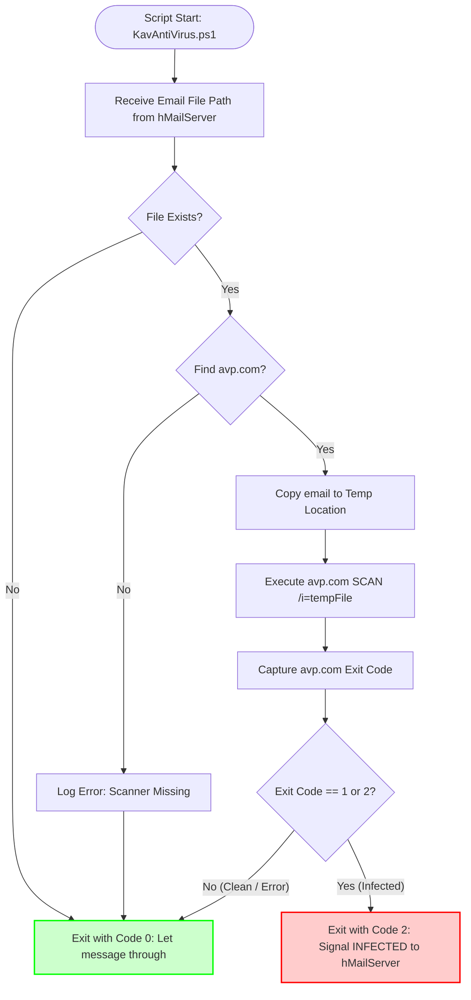

# hMailServer External Antivirus Integrator

[](https://github.com/paulmann/hMailServer-External-Antivirus)
[](LICENSE)
[](https://github.com/PowerShell/PowerShell)
[](https://www.microsoft.com/windows/)
[](https://www.hmailserver.com/)

**Version 1.1.0** — Production-ready PowerShell scripts to integrate Kaspersky and Windows Defender antivirus engines directly into hMailServer's native external antivirus pipeline. Ensures every email is scanned with enterprise-grade protection without compromising mail server performance.

*   [1. Architectural Philosophy](#1-architectural-philosophy)
    *   [1.1 The hMailServer Design Gap](#11-the-hmailserver-design-gap)
    *   [1.2 Why External Integration is Critical](#12-why-external-integration-is-critical)
*   [2. Key Features](#2-key-features)
*   [3. System Requirements](#3-system-requirements)
*   [4. Installation Guide](#4-installation-guide)
    *   [4.1 Script Deployment](#41-script-deployment)
    *   [4.2 Verify Antivirus CLI Availability](#42-verify-antivirus-cli-availability)
*   [5. hMailServer Configuration (External Anti-virus)](#5-hmailserver-configuration-external-anti-virus)
    *   [5.1 Step-by-Step Setup](#51-step-by-step-setup)
    *   [5.2 Critical: Understanding Return Codes](#52-critical-understanding-return-codes)
*   [6. Antivirus Engine Workflows & Logic](#6-antivirus-engine-workflows--logic)
    *   [6.1 Kaspersky Integration (`KavAntiVirus.ps1`)](#61-kaspersky-integration-kavantivirusps1)
    *   [6.2 Windows Defender Integration (`WinDefAntiVirus.ps1`)](#62-windows-defender-integration-windefantivirusps1)
*   [7. 🛡️ Critical: Antivirus Exclusions](#7-critical-antivirus-exclusions)
*   [8. Troubleshooting & Best Practices](#8-troubleshooting--best-practices)
    *   [8.1 Common Issues & Solutions](#81-common-issues--solutions)
    *   [8.2 Best Practices for Production](#82-best-practices-for-production)
*   [9. License & Author](#9-license--author)

---

## 1. Architectural Philosophy

### 1.1 The hMailServer Design Gap
hMailServer is architected for efficiency and minimalism. It excels at its core function—routing and storing email—but deliberately omits built-in, resource-intensive features like antivirus scanning. This is a conscious design choice that avoids:
*   **Licensing Burdens:** Bundling proprietary engines like Kaspersky would violate their licensing terms and compromise hMailServer's open-source status.
*   **Performance Bottlenecks:** Modern AV scanning (heuristics, unpacking, emulation) is CPU/IO heavy. Integrating it directly into the mail server process would cause debilitating delays.

### 1.2 Why External Integration is Critical
The solution is hMailServer's elegant **External Anti-virus** interface. It delegates the scanning task to a separate process, ensuring:
*   **Performance Isolation:** The main hMailServer process remains responsive while scans run asynchronously.
*   **Vendor Flexibility:** You can use any CLI-capable antivirus engine.
*   **Standardized Control:** hMailServer uses the external process's **exit code** to determine if a message is clean or infected. This project's scripts are built to bridge your chosen AV engine perfectly with this mechanism.

## 2. Key Features

*   **Dual-Engine Support:** Pre-configured, production-tested scripts for **Kaspersky Security** (`KavAntiVirus.ps1`) and **Windows Defender** (`WinDefAntiVirus.ps1`).
*   **Native hMailServer Integration:** Designed specifically for the "External anti-virus" interface, not complex event handlers.
*   **Accurate Return Code Mapping:** Translates each AV engine's specific exit codes into the single code hMailServer expects for infection (`2`). All other outcomes (clean, error) return `0` to allow safe delivery or logging.
*   **Engine Auto-Detection:** Scripts intelligently locate antivirus binaries via standard installation paths and registry keys.
*   **Resilient Error Handling:** Manages timeouts, missing files, and engine failures gracefully, preventing mail delivery deadlocks.
*   **Comprehensive Logging:** Detailed logs for auditing, debugging, and compliance.

## 3. System Requirements

| Component | Requirement | Notes |
| :--- | :--- | :--- |
| **Operating System** | Windows Server 2016/2019/2022 or Windows 10/11 Pro/Enterprise | |
| **hMailServer** | Version 5.6.8 or newer (any 5.x version should work) | |
| **PowerShell** | **PowerShell 7.5 or higher** (Core) | Required for robust performance and modern language features. Download from [GitHub](https://github.com/PowerShell/PowerShell). |
| **Antivirus Engine** | **Option A:** Kaspersky Endpoint Security / Kaspersky Security for Windows Server (with `avp.com` CLI). <br> **Option B:** Microsoft Windows Defender (built-in, with `MpCmdRun.exe`). | Must be installed, licensed (if applicable), and updated. |
| **Permissions** | hMailServer Service Account (e.g., `Local System`, `Network Service`) must have **Read & Execute** rights on the PowerShell script file and the antivirus CLI binaries. | |
| **Disk Space** | Sufficient space for temporary file copies (typically in `%TEMP%`). | |

## 4. Installation Guide

### 4.1 Script Deployment
1.  **Obtain Scripts:** Download `KavAntiVirus.ps1` and `WinDefAntiVirus.ps1` from this repository.
2.  **Create Directory:** Create a secure, permanent folder for the scripts. A recommended location is within the hMailServer installation directory:
    ```powershell
    New-Item -ItemType Directory -Path "C:\Program Files (x86)\hMailServer\Scripts" -Force
    ```
3.  **Copy Script(s):** Place the desired script(s) into this folder. You can install both.
4.  **Set Permissions:** Using File Explorer or `icacls`, ensure the hMailServer service account has `Read & Execute` permissions on this folder and the scripts. If the service runs as `Local System`, this is usually automatic. For a custom account, you must grant the rights explicitly.
    ```powershell
    # Example for a custom service account 'HMailSvc'
    icacls "C:\Program Files (x86)\hMailServer\Scripts" /grant "HMailSvc:(OI)(CI)RX" /T
    ```

### 4.2 Verify Antivirus CLI Availability
Test that your antivirus's command-line scanner is accessible.
*   **Kaspersky:** Open a command prompt and run `"C:\Program Files (x86)\Kaspersky Lab\Kaspersky Endpoint Security for Windows\avp.com" SCAN /?` (adjust path as needed). It should display help.
*   **Windows Defender:** Open a command prompt and run `"%ProgramFiles%\Windows Defender\MpCmdRun.exe" -Scan -ScanType 3 -File test.txt`. It should run without "not found" errors.

## 5. hMailServer Configuration (External Anti-virus)

This is the **correct** way to integrate. Do **not** use advanced event handlers for this purpose.

### 5.1 Step-by-Step Setup
1.  Open **hMailServer Administrator**.
2.  Navigate to **Settings** > **Anti-virus**.
3.  Select the **External anti-virus** tab.
4.  Check the box **Use external anti-virus**.
5.  Configure the fields precisely as follows:

| Field | Value | Explanation |
| :--- | :--- | :--- |
| **Scanner executable** | `"C:\Program Files\PowerShell\7\pwsh.exe"` | Full path to PowerShell 7+ executable. **Quotes are required** if the path contains spaces. |
| **Command line** | `-NoProfile -NonInteractive -File "C:\Program Files (x86)\hMailServer\Scripts\KavAntiVirus.ps1" "%FILE%"` | <br>• `-NoProfile`: Ensures clean environment. <br>• `-NonInteractive`: Prevents interactive prompts. <br>• `-File`: Followed by the **full path to your chosen script**. <br>• `"%FILE%"`: **Crucial placeholder**. hMailServer replaces this with the full path to the temporary email file. **Must be enclosed in quotes.** |
| **Return code for infected** | `2` | **Critical**. Tells hMailServer which exit code from the PowerShell script means "virus found". The scripts are designed to return `2` for infected, `0` for clean/errors. |

**Example for Kaspersky (using PowerShell 7):**
*   **Scanner executable:** `"C:\Program Files\PowerShell\7\pwsh.exe"`
*   **Command line:** `-NoProfile -NonInteractive -File "C:\Program Files (x86)\hMailServer\Scripts\KavAntiVirus.ps1" "%FILE%"`
*   **Return code for infected:** `2`

**Example for Windows Defender (using PowerShell 7):**
*   **Scanner executable:** `"C:\Program Files\PowerShell\7\pwsh.exe"`
*   **Command line:** `-NoProfile -NonInteractive -File "C:\Program Files (x86)\hMailServer\Scripts\WinDefAntiVirus.ps1" "%FILE%"`
*   **Return code for infected:** `2`

### 5.2 Critical: Understanding Return Codes
The entire security model hinges on this value.
*   If the script exits with code `2`, hMailServer **immediately deletes/quarantines** the email (based on your settings).
*   If the script exits with any other code (typically `0`), hMailServer assumes the message is clean and proceeds with delivery.
*   The scripts in this repository are hardcoded to return `2` only when the antivirus engine definitively reports a threat. All other outcomes (clean, scan error, file not found) result in exit code `0` to prevent false positives from blocking legitimate mail.

## 6. Antivirus Engine Workflows & Logic

### 6.1 Kaspersky Integration (`KavAntiVirus.ps1`)
This script uses Kaspersky's `avp.com` command-line interface.

**Workflow:**
1.  **Trigger:** hMailServer launches the script with the temporary email file path (`%FILE%`).
2.  **Validation & Prep:** The script validates the file path, ensures `avp.com` is found, and creates a temporary copy of the email to scan. This prevents locking the original file.
3.  **Scan Execution:** It executes a command similar to: `avp.com SCAN /i=<tempfile>`.
4.  **Exit Code Analysis:** It captures the exit code from `avp.com`.
    *   **Exit Code `0`**: Kaspersky reports "Clean" or "No threats found". The script exits with code `0`.
    *   **Exit Code `1` or `2`**: Kaspersky reports "Infected" or "Threat detected". The script exits with code **`2`**.
    *   **Any other exit code**: An error occurred (e.g., scanner unavailable). The script logs the error and exits with code `0` to allow delivery (fail-open behavior).
5.  **Cleanup:** The temporary email copy is deleted.

**Logic Flow:**


### 6.2 Windows Defender Integration (`WinDefAntiVirus.ps1`)
This script uses Microsoft's native `MpCmdRun.exe` utility.

**Workflow:**
1.  **Trigger:** hMailServer launches the script with the temporary email file path.
2.  **Validation & Prep:** Validates the file path, locates `MpCmdRun.exe` (auto-detects the latest platform version), and creates a temporary copy of the email.
3.  **Scan Execution:** Executes: `MpCmdRun.exe -Scan -ScanType 3 -File <tempfile>`.
4.  **Exit Code Analysis:** It captures the exit code from `MpCmdRun.exe`.
    *   **Exit Code `0`**: Scan completed. Could be clean, or could be infected! Defender often returns `0` even on detection. Therefore, this script **must also parse the output**.
    *   **Exit Code `2`**: Defender explicitly reports "Threat detected". The script exits with code **`2`**.
    *   **Any other exit code**: An error occurred (e.g., scan failed). The script logs and exits with `0` (fail-open).
5.  **Output Parsing (Fallback):** If exit code is `0`, the script scans the console output for strings like `"Threat detected"` or `"DETECTION"`. If found, it overrides the decision and exits with code **`2`**.
6.  **Cleanup:** The temporary email copy is deleted.

**Logic Flow:**
```mermaid
graph TD
    Start([Script Start: WinDefAntiVirus.ps1]) --> Param[Receive Email File Path];
    Param --> ValidateFile{File Exists?};
    ValidateFile -- No --> Exit0[Exit with Code 0];
    ValidateFile -- Yes --> FindScanner{Find MpCmdRun.exe?};
    FindScanner -- No --> LogError[Log Error] --> Exit0;
    FindScanner -- Yes --> CopyEmail[Copy email to Temp];
    CopyEmail --> RunScan[Execute MpCmdRun.exe -Scan -File tempFile];
    RunScan --> CaptureCode[Capture Exit Code & Output];
    CaptureCode --> CodeCheck{Exit Code == 2?};
    CodeCheck -- Yes --> Exit2[Exit with Code 2: INFECTED];
    CodeCheck -- No --> OutputCheck{Output contains<br>"Threat detected"?};
    OutputCheck -- Yes --> Exit2;
    OutputCheck -- No --> Exit0;
    
    style Exit2 fill:#ffcccc,stroke:#f00,stroke-width:2px
    style Exit0 fill:#ccffcc,stroke:#0f0,stroke-width:2px
```

## 7. 🛡️ Critical: Antivirus Exclusions

To prevent recursive scanning, file locking conflicts, and severe performance degradation, you **MUST** configure your main antivirus (Kaspersky or Defender itself) to exclude the following hMailServer directories:

*   `C:\Program Files (x86)\hMailServer\Data\` (The message store)
*   `C:\Program Files (x86)\hMailServer\Temp\` (Where the script creates temporary scan copies)
*   `C:\Program Files (x86)\hMailServer\Logs\` (If you enable script logging)
*   The script directory itself, e.g., `C:\Program Files (x86)\hMailServer\Scripts\`

**Why?** Without these exclusions, the real-time antivirus monitor might try to scan the email file *at the same time* your script is asking the command-line scanner to scan it, leading to hangs, double-scanning, or access denied errors.

## 8. Troubleshooting & Best Practices

### 8.1 Common Issues & Solutions

| Problem | Likely Cause | Diagnostic Steps | Solution |
| :--- | :--- | :--- | :--- |
| **Infected emails are delivered** | Incorrect "Return code for infected". | Check hMailServer setting. | Set to `2`. |
| | Script logic failing to map AV exit code. | Manually run the script from an elevated prompt with a test file to see its output and exit code. | Verify script's AV exit code mapping logic. |
| **All emails are blocked** | False positive from AV engine. | Check antivirus logs for detection. | Add file/type exclusions in the AV engine. |
| | Script always returns `2`. | Test script manually. | Check for hardcoded return values in script. |
| **"Access Denied" in hMailServer logs** | Service account lacks permissions. | Run Process Monitor (ProcMon) to see which access is denied (`pwsh.exe`, script file, temp folder). | Grant the service account `Read & Execute` rights on the script folder and `pwsh.exe`. |
| **Script runs but scan never happens** | Antivirus CLI tool not found. | Check script logs (if enabled) or run script manually. | Verify `avp.com` or `MpCmdRun.exe` path. Update script's auto-detection logic or hardcode the path. |
| **hMailServer hangs or slows down** | Antivirus exclusions not set. | Check for high CPU usage from real-time AV scanning of the `Data` folder. | Configure exclusions as per [Section 7](#7-critical-antivirus-exclusions). |
| | Scan timeout. | Increase the script's internal timeout value (if implemented). |

### 8.2 Best Practices for Production

1.  **Always Use PowerShell 7+:** It's faster, more secure, and better supported than Windows PowerShell 5.1.
2.  **Test in a Staging Environment:** Before deploying to production, test the integration by sending test emails with the [EICAR test file](https://www.eicar.org/download-anti-malware-testfile/).
3.  **Monitor Logs:** Enable logging in the scripts (uncomment the `$logFile` variable) and monitor the output. Also monitor hMailServer's own log for `ANTIVIRUS` entries.
4.  **Keep Everything Updated:** Regularly update hMailServer, PowerShell, and your antivirus engine and its signatures.
5.  **Secure the Scripts:** Ensure the script directory permissions are locked down so only administrators and the hMailServer service account can access them.

## 9. License & Author

This project is licensed under the MIT License - see the [LICENSE](LICENSE) file for details.

**Author:** Mikhail Deynekin ([@paulmann](https://github.com/paulmann))
**Website:** [deynekin.com](https://deynekin.com/)
