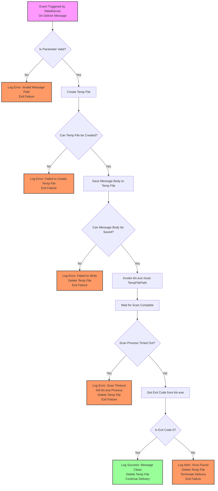
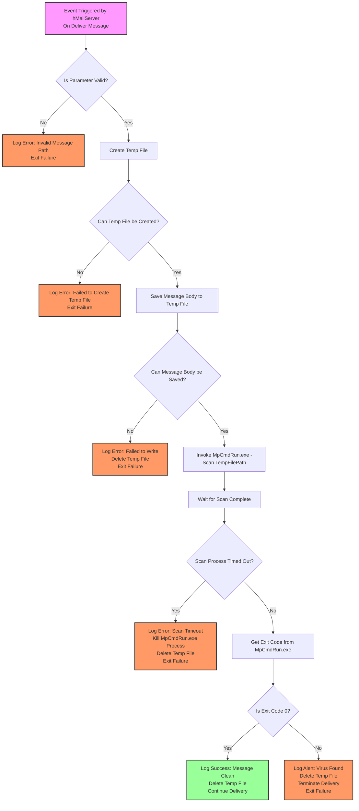

# hMailServer External Antivirus Integration

[](https://github.com/paulmann/hMailServer-External-Antivirus)
[](LICENSE)
[](https://docs.microsoft.com/en-us/powershell/)
[](https://www.microsoft.com/windows/)
[](https://www.microsoft.com/windows/)
[](https://www.hmailserver.com/)

Robust PowerShell-based antivirus integration scripts for hMailServer, supporting **Kaspersky Security** and **Windows Defender**. Designed to secure email delivery pipelines through external event-driven scanning without compromising server performance.

---

## 📑 Table of Contents

1. [Problem Statement & Architecture](#1-problem-statement--architecture)
2. [Key Features](#2-key-features)
3. [System Requirements](#3-system-requirements)
4. [Installation Guide](#4-installation-guide)
5. [Configuration](#5-configuration)
6. [Workflow Architecture](#6-workflow-architecture)
   - [Kaspersky Integration](#kaspersky-integration-workflow)
   - [Windows Defender Integration](#windows-defender-integration-workflow)
7. [Troubleshooting & Best Practices](#7-troubleshooting--best-practices)
8. [License](#8-license)

---

## 1. Problem Statement & Architecture

### The Architectural Gap
hMailServer is engineered around principles of minimalism and efficiency. While this ensures a low resource footprint, it inherently excludes built-in antivirus engines. This is not an oversight but a foundational architectural choice to avoid licensing complexities and performance bottlenecks associated with bundling proprietary security software. However, in modern threat landscapes, email remains a primary vector for malware, ransomware, and phishing payloads.

### Why External Integration is Critical
Deploying this solution addresses three critical architectural constraints:

1.  **Licensing & Compliance:** Antivirus engines (Kaspersky, Microsoft, etc.) are protected by intellectual property rights. Integrating them directly into hMailServer would violate licensing terms. This solution delegates scanning to legally licensed external tools installed on the host OS.
2.  **Performance Isolation:** Modern antivirus scanning involves heuristic analysis and deep content inspection, which are computationally intensive. Running these synchronously within the main hMailServer process would cause latency spikes. These scripts execute scans in separate processes, ensuring the mail server remains responsive even during heavy scanning loads.
3.  **Modular Security:** This approach allows administrators to choose best-of-breed security tools without being locked into a specific vendor. It transforms the antivirus into a pluggable security module, aligning with modern microservices architecture principles.

> **Note:** Without proactive scanning at the point of delivery, an hMailServer installation becomes a vulnerable entry point. This project bridges that gap securely.

---

## 2. Key Features

*   **Dual-Engine Support:** Pre-configured scripts for **Kaspersky Security** (`KavAntiVirus.ps1`) and **Windows Defender** (`WinDefAntiVirus.ps1`).
*   **Event-Driven Execution:** Utilizes the hMailServer `On Deliver Message` event handler for real-time scanning before inbox delivery.
*   **Secure Temp Handling:** Creates isolated temporary copies of message bodies for scanning, preventing file locks on active mail store files.
*   **Exit Code Orchestration:** Interprets antivirus exit codes to automatically allow clean messages or terminate delivery of infected ones.
*   **Timeout Protection:** Built-in process timeout mechanisms prevent hung scanners from blocking the mail server queue.
*   **Error Containment:** Script errors are logged and handled locally, ensuring stability of the core hMailServer service.

---

## 3. System Requirements

Ensure the following prerequisites are met before deployment:

| Component | Requirement | Notes |
| :--- | :--- | :--- |
| **OS** | Windows Server 2012 R2 or newer | Compatible with hMailServer and AV tools. |
| **hMailServer** | Version 5.6 or newer | Requires stable Event Handler API. |
| **PowerShell** | Version 5.1 or newer | Required for script execution. |
| **Antivirus** | Kaspersky Security **OR** Windows Defender | Must be installed, licensed, and updated. |
| **Permissions** | Local Administrator | hMailServer service account needs execute rights on scripts and AV binaries. |

---

## 4. Installation Guide

### Step 1: Deploy Scripts
1.  Create a dedicated directory for scripts, e.g., `C:\Program Files (x86)\hMailServer\Scripts\Antivirus`.
2.  Download the relevant script(s) from this repository:
    *   [KavAntiVirus.ps1](https://raw.githubusercontent.com/paulmann/hMailServer-External-Antivirus/refs/heads/main/KavAntiVirus.ps1)
    *   [WinDefAntiVirus.ps1](https://raw.githubusercontent.com/paulmann/hMailServer-External-Antivirus/refs/heads/main/WinDefAntiVirus.ps1)
3.  Place the files into the created directory.

### Step 2: Configure Permissions
The account running the hMailServer service must have:
*   **Read & Execute** permissions on the `.ps1` scripts.
*   **Execute** permissions on `powershell.exe`.
*   **Execute** permissions on the antivirus CLI tools (`kln.exe` or `MpCmdRun.exe`).

---

## 5. Configuration

Configure hMailServer to trigger the scripts via **Event Handlers**.

1.  Open **hMailServer Administrator**.
2.  Navigate to **Settings → Advanced → Event Handlers**.
3.  Click **Add** and select event: `On Deliver Message`.
4.  Configure the handler based on your antivirus solution:

### For Kaspersky Security
*   **Application Path:** `C:\Windows\System32\WindowsPowerShell\v1.0\powershell.exe`
*   **Parameters:**
    ```powershell
    -ExecutionPolicy Bypass -File "C:\Program Files (x86)\hMailServer\Scripts\Antivirus\KavAntiVirus.ps1" -MessagePath $messagepath
    ```

### For Windows Defender
*   **Application Path:** `C:\Windows\System32\WindowsPowerShell\v1.0\powershell.exe`
*   **Parameters:**
    ```powershell
    -ExecutionPolicy Bypass -File "C:\Program Files (x86)\hMailServer\Scripts\Antivirus\WinDefAntiVirus.ps1" -MessagePath $messagepath
    ```

5.  **Save** the configuration and restart the hMailServer service.

---

## 6. Workflow Architecture

The following diagrams illustrate the complete logic flow, including error handling, timeout management, and decision branches.

### Kaspersky Integration Workflow



### Windows Defender Integration Workflow



---

## 7. Troubleshooting & Best Practices

### Common Issues

| Problem | Symptom | Likely Cause | Solution |
| :--- | :--- | :--- | :--- |
| **Script Not Executing** | Messages delivered without scan. | Incorrect path in Event Handler. | Verify full path to `.ps1` in Parameters field. |
| **Access Denied** | Errors in hMailServer logs. | Service account permissions. | Grant **Read & Execute** on scripts and AV tools. |
| **Antivirus Idle** | Script runs, no AV activity. | AV service stopped or outdated. | Update signatures and ensure On-Access scanning is enabled. |
| **High Server Load** | Latency during email traffic. | Aggressive scan settings. | Optimize AV scan profiles or increase script timeout. |
| **False Positives** | Legitimate emails deleted. | Heuristic analysis sensitivity. | Add exclusion rules in AV console for specific file types. |

### Best Practices
1.  **Monitor Logs:** Regularly review hMailServer logs for script exit codes. Non-zero codes indicate blocked threats or errors.
2.  **Update Routine:** Keep both hMailServer and Antivirus definitions updated to ensure compatibility and threat detection.
3.  **Backup Configuration:** Maintain backups of Event Handler configurations before making changes.
4.  **Security Audit:** Periodically audit the `Scripts` directory permissions to prevent unauthorized modification.

---

## 8. License

This project is licensed under the MIT License - see the [LICENSE](LICENSE) file for details.

---
*Maintained with ❤️ by [paulmann](https://github.com/paulmann)*
